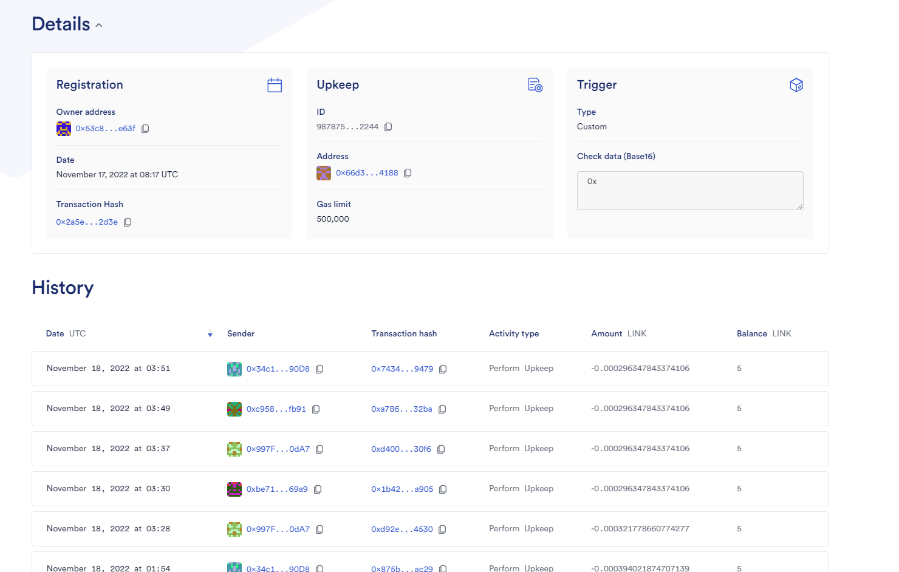
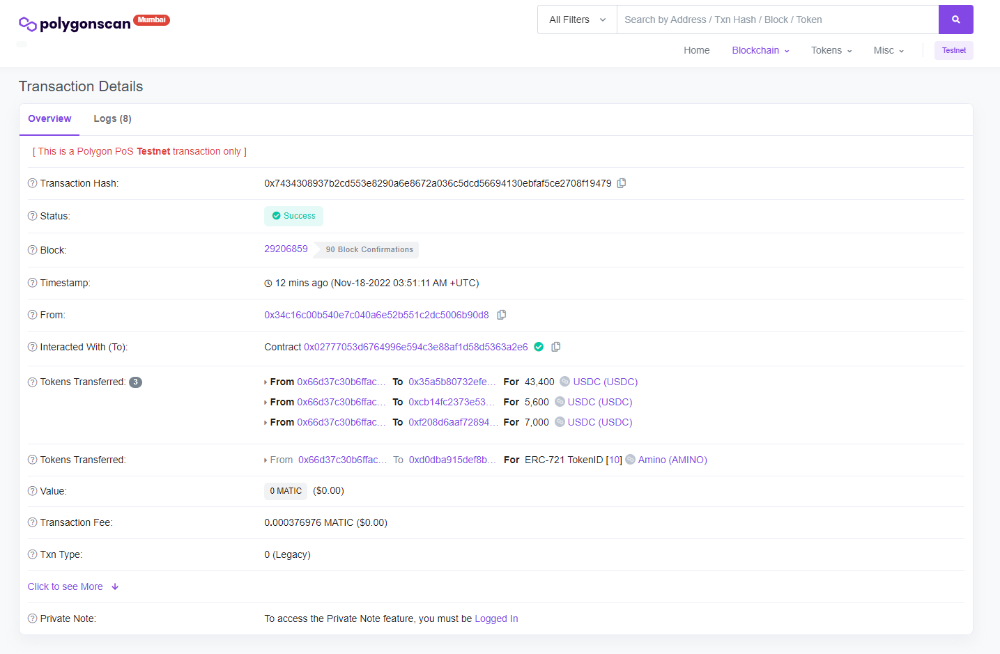
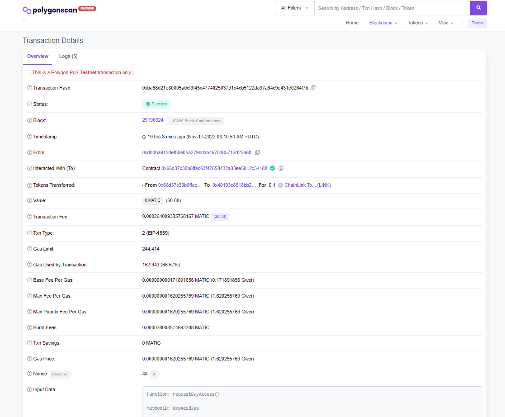
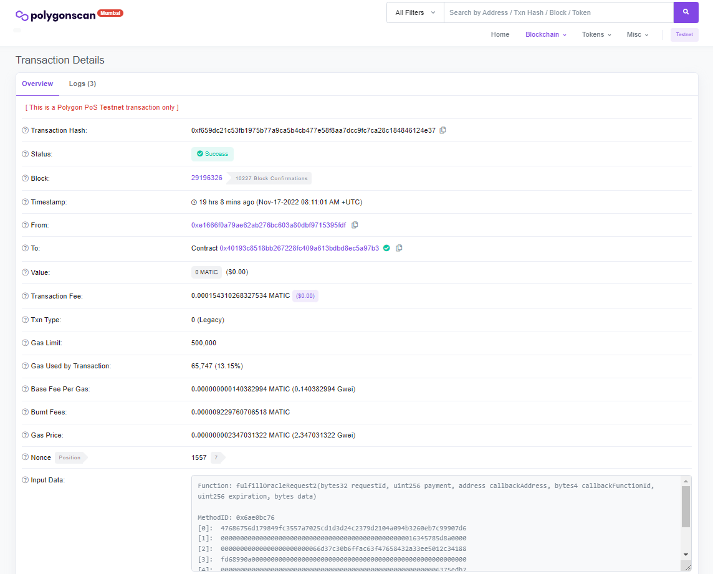
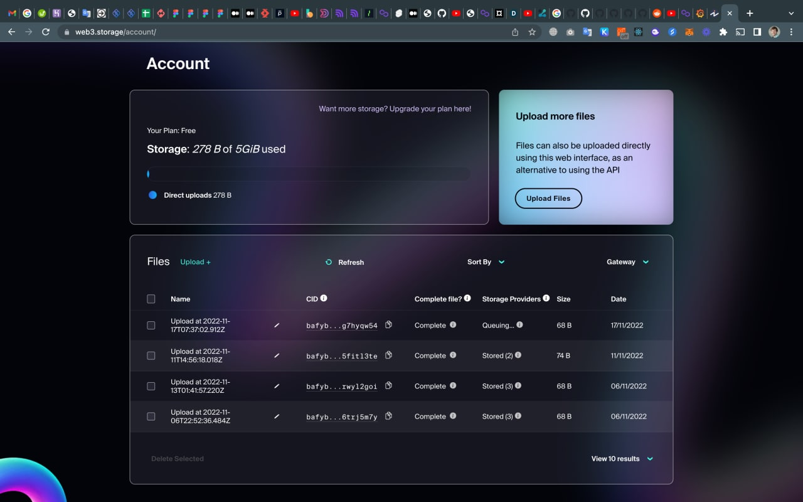

# Introduction

Every 9 minutes someone in the US dies of blood cancer [[1](https://www.lls.org/facts-and-statistics/facts-and-statistics-overview#:~:text=Approximately%20every%209%20minutes%2C%20someone,than%20six%20people%20every%20hour.)], 
and 186,000 patients are diagnosed with blood cancer every year [[2](https://www.lls.org/facts-and-statistics/facts-and-statistics-overview#:~:text=Approximately%20every%209%20minutes%2C%20someone,than%20six%20people%20every%20hour.)]. 
The best way to save these patients is through a process known as Stem Cell Transplantation Therapy, a process in 
which you take stem cells from a healthy donor and engraft them into a sick patient. The matching criteria between a 
donor and a patient are very stringent, and they highly depend on matching individuals based on ancestry and ethnicity 
(i.e., HLA genetics). In over 70% of cases, donors cannot find a match in their immediate family and are forced to 
search national stem cell registries; these registries consist of a large database of volunteer donors that are called 
up on a case-by-case basis [[3](https://www.giftoflife.org/patients#:~:text=Family%20Resources,-It%20is%20reported&text=Only%2030%20percent%20of%20patients,lymphoma%20can%20be%20emotionally%20devastating.)].

The US national stem cell registry finds donors for 79% of white blood cancer patients, 48% of Hispanic patients, 
47% of Pacific Islander patients, and only 29% of African American patients [[4](https://bethematch.org/transplant-basics/matching-patients-with-donors/how-does-a-patients-ethnic-background-affect-matching/)]. 
Ethnic minority individuals are highly skeptical of the US healthcare system because of many prior instances of abuse 
and mistrust, and this causes thousands of patients to die needlessly every year. We are a creating a platform that 
centers on transparency, ownership, and benefit sharing, such that donors can rebuild their trust with the healthcare 
system and no blood cancer patient dies too soon again. This platform is uniquely designed in a way that it can serve 
many further healthcare applications, and ultimately become the bedrock of the future of US healthcare.

There are numerous stem cell registries and advocacy groups in the US, but all these are managed by, and feed donor and 
patient transplant data into, the federally contracted National Marrow Donor Program (NMDP) or “Be the Match” [[5](https://bethematch.org/become-a-donor/?gclid=CjwKCAiA68ebBhB-EiwALVC-NgOZG0sqXR1-mWsaWdfcr9-2aT3GWgmiPQYxZ4jnNtLkgvWTQI2wvRoCTgMQAvD_BwE)]. The NMDP 
manages all requests for allogenic stem cells, and hence the current donor acquisition and search and match process is 
highly centralized; the NMDP takes stem cells from altruistic donors “for free” and sells them to patients in need for 
$40K, and the donor receives nothing. Aside from the lack of monetary incentives, this feeds into a larger issue that 
national research is based on “broad consent”, which means that donors sign off on the fact that the managing medical 
body can do whatever they like with the donated genetic material. This, among other things, has led to an increasing 
lack of trust in the US healthcare system; only 5% of clinical trial participants are black [[6](https://www.aamc.org/news-insights/clinical-trials-seek-fix-their-lack-racial-mix)], African-Americans only make up 10% of COVID-19 vaccine recipients [[7](https://www.kff.org/coronavirus-covid-19/issue-brief/latest-data-on-covid-19-vaccinations-by-race-ethnicity/)], and in the dawning era of precision medicine, the NIH is desperately looking for ways to build a firmer foundation of trust [[8](https://jamanetwork.com/journals/jama/article-abstract/2769506)]

# How It Works

Doctors and researchers search for donations by matching the genes of the donor's HLA haplotype (which is a combination of the donor's _HLA-A, HLA-B, HLA-C, HLA-DPB, HLA-DRB_ gene alleles) to their desired haplotype. To protect the donor's identity and data, their HLA data cannot be stored unencrypted on the blockchain. Thus we store the donor's HLA data as a struct of hashes corresponding to each of their HLA genes. The match rate of a search is determined by matching the hashed genes to the hashes of a doctor/researcher's search inputs (E.G. If one gene hash matches the corresponding input hash then the match rate would be 1/5). 

**Potential Security Flaw:** Users can potentially determine the donor's HLA Haplotype data via these matches. In the future, we plan to handle matching with a different method to prevent this from happening. Having said that, the HLA genomic region is the most polymorphic in the human genome; there are over 71,236 different HLA alleles that are known and sequenced, and the HLA diversity of the human population is ever expanding [[9](http://hla.alleles.org/nomenclature/stats.html)]. Identifying a specific individual, let alone their personal or identifying data information, would be extremely difficult to decrypt via an HLA haplotype. 

In addition to hashes, an encryption of the donors' HLA data is stored on-chain. Our backend can then decrypt the donor's HLA data at the request of a verified doctor/researcher. Encryption/decryption is handled by [amino-backend][1] with the AES-JS engine.

The full genetic sequence and health data of the donors are encoded and stored in IPFS. [amino-backend][1] handles the encoding,
storing in IPFS, fetching from IPFS, and decoding of the data. For reference, [amino-backend][1] `uploadGenomeToIpfs` function and
`/decode-genome/:tokenId` endpoint, also refer to [test/Ipfs.test.ts](https://github.com/AminoChain/amino-backend/blob/main/test/Ipfs.test.ts) as an example.

Doctors'/researchers' wallets also are required to be verified before they are permitted to purchase stem cells. For now, we handled this by assuming that all addresses are verified via the [amino-backend][1] endpoint `/is-it-doctor-or-researcher-address/:address`. By utilizing ChainLink Any API, we can whitelist addresses within the [AminoChainMarketplace][3] contract based on a call to our API. Thus simulating the verification process of a doctor/researcher. The full implementation of the verification process is outside of the scope of the current development phase, but a long term solution that we would be extremely interested in implementing would be Chainlink DECO to manage KYC checks [[10](https://www.chainlinkecosystem.com/ecosystem/deco)]. 

The process of purchasing stem cells includes the physical tracking of donations as well as an escrow system to deter bad actors. The doctor/reseacher initiates a sale (with their whitelisted wallet) by sending payment (USDC tokens) to the [AminoChainMarketplace][3] contract. The contract then holds them in escrow until the delivery is complete. Durring this step, the specified tokenized donation (NFT) is also transferred from the [AminoChainAuthenticator][2] to the [AminoChainMarketplace][3] to be held in escrow. As the physical delivery is initiated and updated, it gets tracked by the [delivery_client](https://github.com/AminoChain/delivery_client). After the stem cells are delivered, [delivery_client](https://github.com/AminoChain/delivery_client) sets the delivery status of the corresponding tokenId to `DELIVERED`. Upon this state change, Chainlink Automation detects that the payment and token need to be unescrowed. Chainlink Automation does this by calling `completeItemSale` which transfers the NFT to the buyer, an incentive to the donor wallet, the payment to the biobank wallet, and a protocol fee to [AminoChainAuthenticator][2] contract. In the case of a delivery not taking place within 30 days, Chainlink Automation will call `refundSale` which will unescrow and transfer payment back to the buyer and the NFT back to [AminoChainAuthenticator][2] contract.

# Donation Registration

1. Biobank enters HLA data, genome data, and donation packing quantities in CC (cubic centimeters) in http://amino-vercel-app.vercel.app/biobank/appointments/register
2. Donor connects his/her wallet by scanning the authentication QR code
3. Donor signs message
4. [amino-backend][1] encodes HLA and genome data, then uploads encoded genome to IPFS and registers the donation by calling the `register` method of [AminoChainAuthenticator][2] contract
5. Donation is automatically listed on marketplace ([AminoChainMarketplace][3] contract) 
6. Donor can now see his tokenized donation on https://amino-vercel-app.vercel.app/donate/profile. Also, Doctors and Researchers can now find the donation on the marketplace https://amino-vercel-app.vercel.app/marketplace

# Purchase

1. Doctors/Reseachers are verfied and whitlisted to buy via `requestBuyAccess` on [AminoChainMarketplace][3]
2. Doctors/Reseachers search for desired stem cells by inputting desired HLA Haplotype data on https://amino-vercel-app.vercel.app/marketplace
3. Best matching donation is automaticaly determined. E.G: https://amino-vercel-app.vercel.app/marketplace/nft?tokenId=11&matchRating=100
4. Then doctor/reseacher connects their wallet by pressing `gm, insert wallet address` and selecting their wallet
5. Prior to purchasing, the buyer may need to know HLA Haplotype, genetic sequence, and health data of the donation. To get this data they can reveal `HLA Haplotypes` and `Genome and Donor Condition Details`
6. To purchase, the doctor press `Buy Now` and confirms transactions. If its their first purchase, they need to give USDC allowance to the [AminoChainMarketplace][3] contract via a seperate transaction.

# Delivery

1. On the purchase of stem cells, USDC payment, and NFT are escrowed in the [AminoChainMarketplace][3] and the physical delivery status of the stem cells is tracked by [delivery_client](https://github.com/AminoChain/delivery_client/blob/main/Tracking_Client/models/contractWatcher.js)
2. [AminoChainMarketplace][3] `updateDeliveryStatus` method is called in the event of a delivery status update. The stem cells' on-chain status could be updated to `IN_TRANSIT` or `DELIVERED` based on the physical state.
3. If the delivery status is `DELIVERED`, Chainlink Automation will call `preformUpKeep` which will then call [AminoChainMarketplace][3] `completeItemSale`
4. Upon a sale being completed, the NFT will be sent to the buyer, an incentive will be transferred to the donor, a fee will be transferred to [AminoChainAuthenticator][2], and the rest of the payment will be transferred to the BioBank's wallet address

# Proof of Chainlink Automation on Polygon Mumbai

We used Chainlink Automation to release the escrowed tokens for a given tokenId's pending sale. After determining if the tokens need to be unescrowed (either in the event of delivered stem cells or a refund), it will transfer the escrowed tokens to the parties involved in the sale. This includes the donor, buyer, bioBank and [AminoChainAuthenticator][2] contract. 



[Click to view Tx on Polygonscan](https://mumbai.polygonscan.com/tx/0x7434308937b2cd553e8290a6e8672a036c5dcd56694130ebfaf5ce2708f19479)

# Proof of Chainlink Any Api on Polygon Mumbai

We used Chainlink Any Api to whitelist doctors/reseachers, which allows them to buy stem cells on our [AminoChainMarketplace][3] contract. This is done by making a HTTP GET request to our [amino-backend][1] endpoint `/is-it-doctor-or-researcher-address/:address`. If the endpoint returns true then the user's wallet address is whitelisted and they are allowed to purchase stem cells.


[Click to view ChainlinkRequested Tx on Polygonscan](https://mumbai.polygonscan.com/tx/0xba58d21e80005a0cf3f45c4774ff25037d1c4cb5122da97a64c9e431e0264f7b)

[Click to view ChainlinkFullfilled Tx on Polygonscan](https://mumbai.polygonscan.com/tx/0xf659dc21c53fb1975b77a9ca5b4cb477e58f8aa7dcc9fc7ca28c184846124e37)

# Proof of IPFS via Web3 Storage

We used IPFS to store the full genetic sequence and health data of the donors. When a bioBank registers (mints) NFTs to represent the donor's donation, the donor's genetic sequence and health data is encoded and stored on IPFS via Web3 Storage. [amino-backend][1] handles the encoding, storing in IPFS, fetching from IPFS, and decoding of the data.
This data can then be fetched by verified doctors/reseachers prior to their purchase of stem cells.


[Click to view an encoded genome stored on IPFS](https://bafybeifaoyt27iexesopszpte2nxksj4uipaa5ti4laaqjp37ng7hyqw54.ipfs.w3s.link/)

# Modules:

- [amino-backend][1] -- Backend
- [amino-contracts](https://github.com/AminoChain/amino-contracts) -- Smart Contracts
- [amino-subgraph](https://github.com/AminoChain/amino-subgraph) -- Subgraph
- [Amino-Vercel-App](https://github.com/AminoChain/Amino-Vercel-App) -- UI
- [delivery_client](https://github.com/AminoChain/delivery_client) -- Delivery tracking


[1]: https://github.com/AminoChain/amino-backend
[2]: https://github.com/AminoChain/amino-contracts/blob/master/contracts/AminoChainAuthenticator.sol
[3]: https://github.com/AminoChain/amino-contracts/blob/master/contracts/AminoChainMarketplace.sol

# Contract Deployments on Polygon Mumbai:

```
MockUSDC: 0xC203D5b1356cc1C71791185Cc51aDbd2226221B6
AminoChainMarketplace: 0x66d37c30B6fFAC63F47658432a33ee5012C34188
AminoChainDonation: 0x61048058C2ac5BcCD10aeF9BaBDC56250DC5753B
AminoChainAuthenticator: 0xcB14fc2373e536ffb131795A2eabD8Cab57bd105
```


